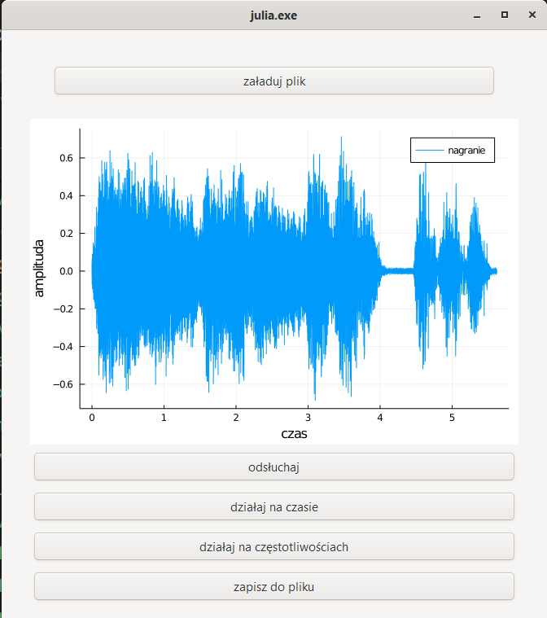
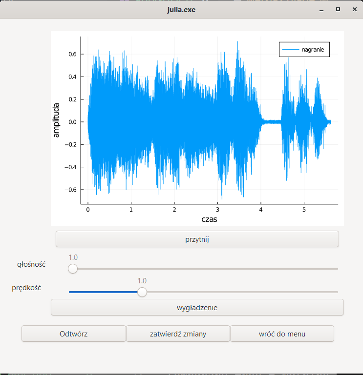
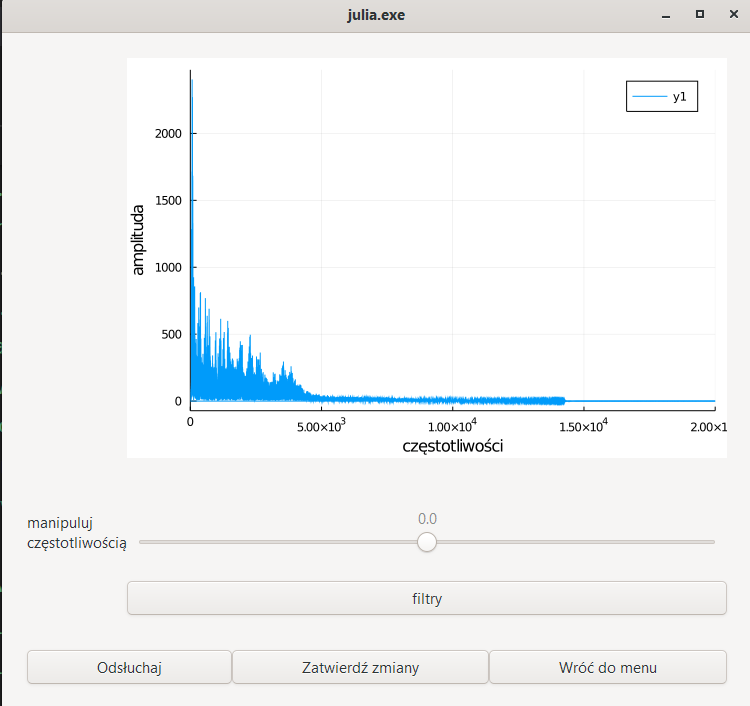

 # 
 Processing and analysis of the sound in Julia 

 ## Short description

 This project was created during the Mathematical Packages course by students from Faculty of Pure and Applied Mathematics at the Wroclaw University of Science and Technolody. 
 It is used for processing and analysis of the sound. Graphical User Interface gives all of the funcionalities written in this project.

 ### Here are the functionalities:
 * changing frequency,
 * denoising based on the PSD,
 * removing frequencies,
 * lowpass and highpass,
 * changing speed,
 * changing volume,
 * cutting time,
 * smoothig signal,
 * calculating FFT and IFFT.

## Authors:
1. Jaworek Klaudia
2. Jelito Natalia
3. Spik Urszula
4. Szymkowiak Magdalena

## Technologies:
**Julia** - programming language, version 1.5.3 is recommended.

**WAV** - package that enable working with sound files, give the ability to read them as a matrix.

**FFTW** - package used in processing sounds, used to speed up the calculations in the application.

**Plots** - package for visualisation, used to create graphs of our sound.

**Gtk** - package providing Graphical User Interface, used to create our application.

## Some pictures showing our GUI:

## How to run this program?
1. Clone the project to your directory: `git clone https://github.com/Klaudia226/Fourier-project.git`.
2. In Julia's terminal type:
   `using Pkg; Pkg.add(["OffsetArrays","WAV", "FFTW", "Plots","Gtk"])`
3. Open `appGUI.jl` in Visual Studio Code and click *Julia: Execude file in REPL* to run.